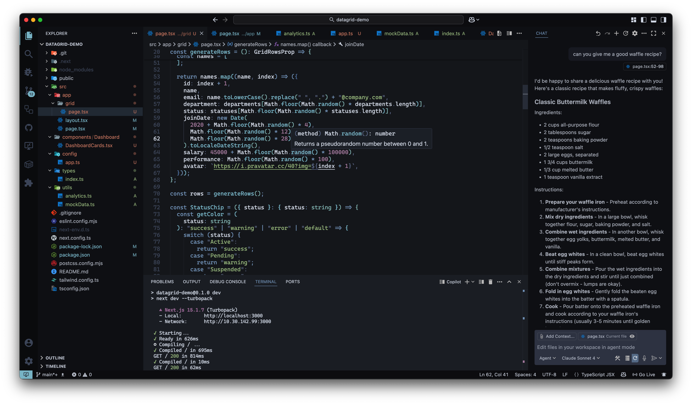

# Nord Zero

A refined version of the Nord theme.

## Screenshots

## Installation

1. Download the `.vsix` file from releases
2. Install via VS Code: `Extensions: Install from VSIX...`
3. Select the theme: `Preferences: Color Theme` → `Nord Zero`

## Credits

This theme is based on [Nord Midnight](https://github.com/adorabilis/nord-midnight-vscode) by adorabilis.

## License

MIT License - see [LICENSE](LICENSE) file for details.

## Changelog

### 0.1.0

- Initial release
