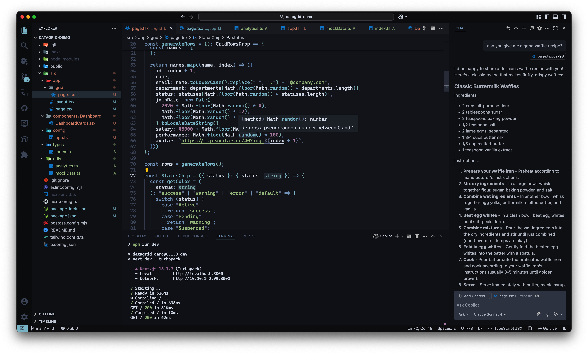

# Nord Zero

A refined version of the Nord theme.

## Screenshots

## Installation

### Option 1: VS Code Extensions (Recommended)

1. Open VS Code
2. Go to Extensions (Ctrl+Shift+X / Cmd+Shift+X)
3. Search for "Nord Zero"
4. Click Install
5. Select the theme: `Preferences: Color Theme` → `Nord Zero`

### Option 2: Direct Download

Download the latest `.vsix` file from [GitHub Releases](https://github.com/QendrimBehrami/nord-zero/releases) and install via:

- VS Code → Extensions → Install from VSIX...

### Option 3: Marketplace Link

Install directly from the [VS Code Marketplace](https://marketplace.visualstudio.com/items?itemName=Behrami.nord-zero).

## Credits

This theme is based on [Nord Midnight](https://github.com/adorabilis/nord-midnight-vscode) by adorabilis.

## License

MIT License - see [LICENSE](LICENSE) file for details.

## Changelog

See [CHANGELOG.md](CHANGELOG.md) for version history and release notes.
